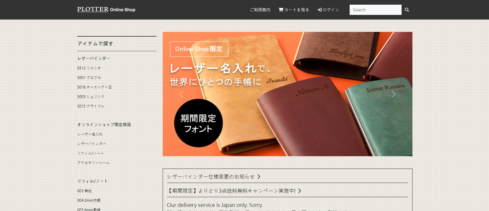
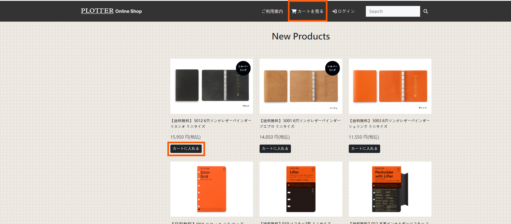
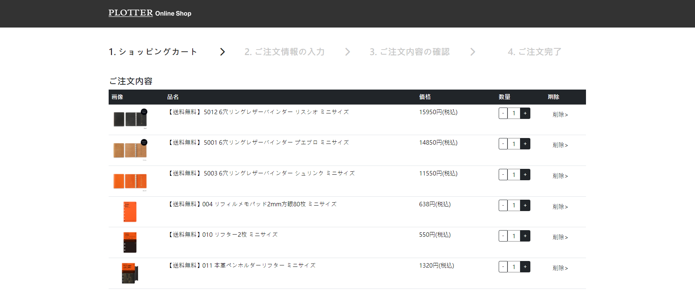
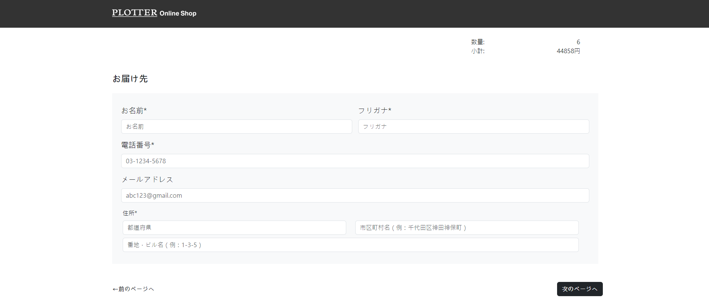
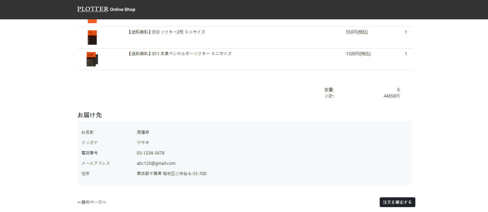
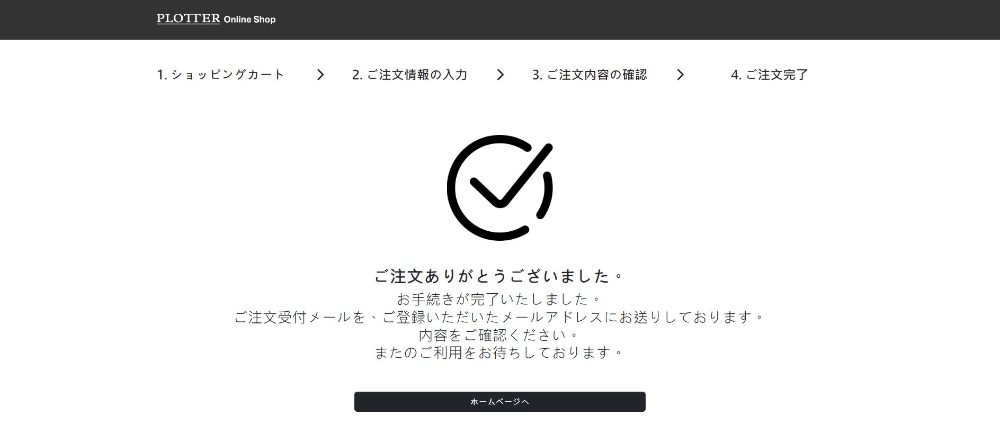

# Plotter網站首頁仿切+購物車功能

**使用Bootstrap框架進行切版與設計**
**購物車功能:**
  - 商品數量增減按鈕
  - 個別金額計算
  - 總金額與數量計算
  - 使用localstorage暫存資料

查看網站→ [Page](https://sanaaa1017.github.io/plotter-shopping-cart/)

**網站首頁**：
含RWD響應式設計
 
**購物步驟**
1. 首頁下方點擊「カートに入れる」 將商品加入購物車，之後點擊導覽列「カートを見る」
 
2. 查看購物車商品品項與選購數量

3. 填寫配送資料

4. 確認品項、數量、金額和配送資料是否正確

5. 完成購物

